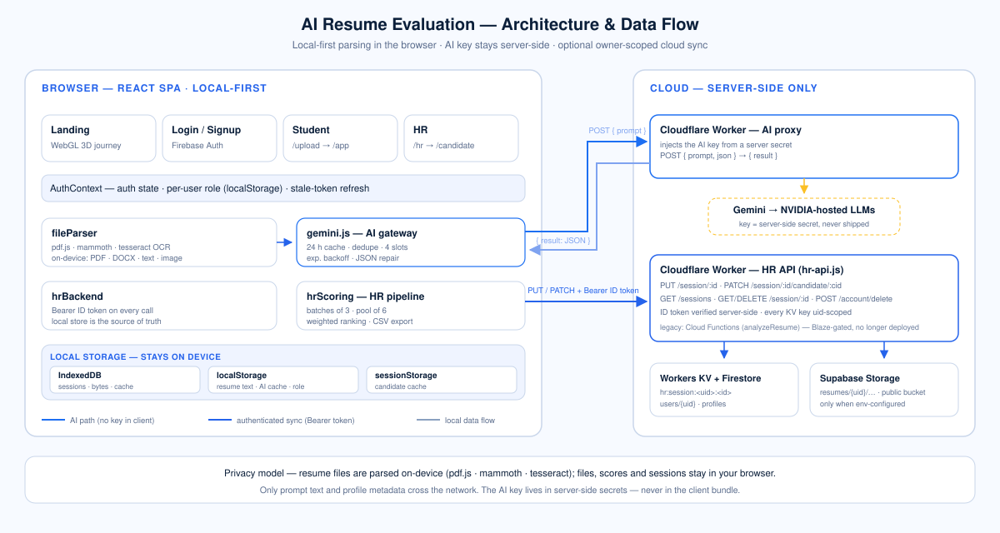

# 📚 AI Resume Evaluation — Project Wiki

**Welcome!** This is the complete, professional documentation wiki for the **AI-Driven Resume Evaluation and Parsing System** — a React SPA that turns resumes into career intelligence for **students** (readiness scoring, skill gaps, roadmaps) and **recruiters** (batch AI evaluation, ranking, comparison).

> ⚠️ This wiki contains **no secrets**: no API keys, no real deployment URLs, no credentials. Environment variables are referenced by **name only**.

---

## 🗺️ Wiki map

Every section is a folder. Start with **Getting Started**, then follow your role:

| Section | What's inside | Start here if… |
| --- | --- | --- |
| **[🚀 Getting Started](./getting-started/)** | Product tour, quickstart, glossary | You're new to the project |
| **[🏗️ Architecture](./architecture/)** | System overview, data flow, routing & guards | You want the big picture |
| **[🖥️ Frontend](./frontend/)** | Pages, components, design system, motion, state | You're touching UI |
| **[⚙️ Services](./services/)** | Every service module & export explained | You're touching logic |
| **[🧠 AI Pipeline](./ai-pipeline/)** | Prompts, reliability, ranking math, copilot | You're touching AI features |
| **[☁️ Backend](./backend/)** | HR API worker, AI proxy worker, (legacy) Cloud Functions, security rules | You're touching the cloud |
| **[🔐 Data & Privacy](./data-and-privacy/)** | Data inventory, deletion paths | You care about compliance |
| **[🧪 Testing](./testing/)** | Test suites, quality gates | You're verifying changes |
| **[🛠️ Operations](./operations/)** | Configuration, deployment, troubleshooting | You're shipping |
| **[🧰 Tutorials](./tutorials/)** | Step-by-step setup: Firebase, API keys, wiring the APIs | You're configuring the app for the first time |
| **[📖 Reference](./reference/)** | Tech stack, full file map | You want lookup tables |

## 🧭 Learning paths

**New contributor:** [Product Overview](getting-started/product-overview.md) → [System Architecture](architecture/system-overview.md) → [Project Map](reference/project-map.md) → pick your area above.

**Frontend work:** [Design System](frontend/design-system.md) → [Pages](frontend/pages.md) → [Components](frontend/components.md) → [Motion](frontend/motion-and-loading.md)

**Backend work:** [HR API Worker](backend/hr-api.md) → [Worker Proxy](backend/worker-proxy.md) → [Cloud Functions](backend/cloud-functions.md) (legacy) → [Security Rules](backend/security-rules.md)

**Launch day:** [Free Hosting Runbook](operations/free-hosting-runbook.md) → [Launch-Day Checklist](operations/launch-checklist.md) → [Quality Gates](testing/quality-gates.md) → [Troubleshooting](operations/troubleshooting.md)

**AI features:** [Prompt Catalog](ai-pipeline/prompt-catalog.md) → [Reliability](ai-pipeline/reliability.md) → [Ranking Math](ai-pipeline/ranking-math.md)

**Configure everything:** [Tutorials → Firebase Setup](tutorials/firebase-setup.md) → [Get the API Keys](tutorials/get-api-keys.md) → [Configure the APIs](tutorials/configure-apis.md)

---

## Quick facts

- **App type:** Single-page React app (no PWA / no service worker)
- **Frontend:** React 19 · Vite 8 · Tailwind CSS 4
- **Auth:** Firebase (email/password + Google)
- **Cloud:** Cloudflare Workers (AI proxy + HR API w/ KV) · Firebase Auth + Firestore · Supabase Storage · (legacy) Cloud Functions
- **AI:** LLM proxied server-side — the key **never ships in the browser bundle**
- **Local-first:** resumes, sessions, and results live in the browser by default
- **Quality:** Vitest (127 tests) · oxlint (0 errors) · UI contrast audit · production build



## Quick start

```bash
npm install
cp .env.example .env        # fill in values (names in Operations → Configuration)
npm run dev                 # vite dev server on :5173
npm test                    # vitest (127 tests)
npm run lint                # oxlint
npm run test:ui             # static UI contrast/hover audit (138 files)
npm run build               # production build → dist/
```

---

*Navigation tip: every page ends with **Related pages** links, and section indexes list their children — you can wander the whole wiki without touching the browser's back button.*
